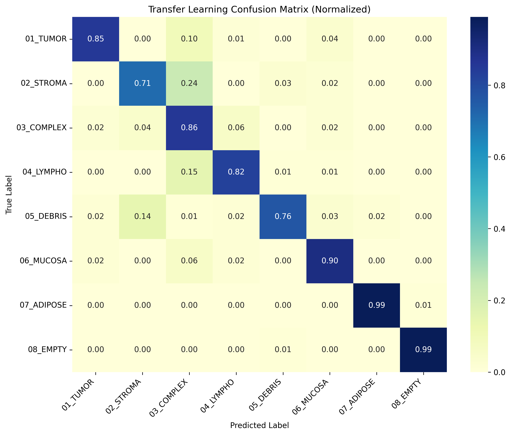

# 🧠 Colon Cancer Tissue Classification using Deep Learning

This project focuses on **classifying histopathological colon tissue images** into 8 categories using:

* 🧩 A **Custom CNN (from scratch)**
* 🚀 **Transfer Learning (MobileNetV2)**

The goal is to compare traditional CNN learning vs pretrained models for medical image classification.

---

## 📌 Project Highlights

* ✅ Built a CNN model from scratch
* ✅ Implemented transfer learning using MobileNetV2
* ✅ Compared performance using multiple metrics
* ✅ Used real-world histopathology dataset
* ✅ Visualized results with confusion matrices and training curves
* ✅ Organized project using clean ML structure

---

## 🗂️ Dataset

* Source: [Kaggle - Colorectal Histology MNIST](https://www.kaggle.com/datasets/kmader/colorectal-histology-mnist)
* Total images: ~5,000
* Classes: 8 tissue types

| Class      | Description        |
| ---------- | ------------------ |
| 01_TUMOR   | Tumor tissue       |
| 02_STROMA  | Connective tissue  |
| 03_COMPLEX | Complex structures |
| 04_LYMPHO  | Lymphocytes        |
| 05_DEBRIS  | Dead cells         |
| 06_MUCOSA  | Mucosal tissue     |
| 07_ADIPOSE | Fat tissue         |
| 08_EMPTY   | Background         |

---

## ⚙️ Data Preprocessing

* Converted `.tif` → `.png` for compatibility
* Normalized pixel values
* Resized images (~150×150)
* Applied data augmentation (training only)
* Train/Validation/Test split used

---

## 🏗️ Model Architectures

### 🔹 1. Custom CNN (from scratch)

Architecture:

```
Input (150x150x3)
↓
Conv2D (ReLU)
↓
MaxPooling
↓
Conv2D (ReLU)
↓
MaxPooling
↓
Flatten
↓
Dense (ReLU)
↓
Dropout
↓
Dense (Softmax - 8 classes)
```

---

### 🔹 2. Transfer Learning (MobileNetV2)

* Pretrained on ImageNet
* Feature extractor frozen
* Custom classifier added

```
MobileNetV2 (base)
↓
Global Average Pooling
↓
Dense (ReLU)
↓
Dropout
↓
Dense (Softmax - 8 classes)
```

---

## 🧪 Training Strategy

* Loss: `Sparse Categorical Crossentropy`
* Optimizer: `Adam`
* Metrics: Accuracy, Precision, Recall, F1-score

### Callbacks used:

* ⏹️ EarlyStopping
* 💾 ModelCheckpoint
* 📉 ReduceLROnPlateau

---

## 📊 Results

### 🔹 Scratch CNN

* Accuracy: ~85%
* Macro F1-score: ~0.85

### 🔹 Transfer Learning

* Accuracy: ~88%
* Macro F1-score: ~0.88

👉 Transfer learning shows better generalization and performance.

---

## 📈 Visualizations

### Training Performance

* Accuracy vs Epochs
* Loss vs Epochs

### Confusion Matrix

* Class-wise performance analysis

Example:



---

## 📁 Project Structure

```
Colon-Cancer-Tissue-Analysis/
│
├── data/                  # Dataset (not fully included)
├── notebooks/
│   └── colon_cnn_projects.ipynb
│
├── results/
│   ├── metrics/
│   └── plots/
│
├── models/               # Saved models
├── requirements.txt
├── environment.yml
├── README.md
└── LICENSE
```

---

## ⚙️ Setup Instructions

### Option 1: Using Conda

```bash
conda env create -f environment.yml
conda activate tfgpu
```

### Option 2: Using pip

```bash
pip install -r requirements.txt
```

---

## ▶️ How to Run

```bash
jupyter notebook notebooks/colon_cnn_projects.ipynb
```

Run all cells to:

* preprocess data
* train models
* evaluate results

---

## 📦 Dataset Setup

⚠️ Dataset is not included due to size.

Download from:

👉 https://www.kaggle.com/datasets/kmader/colorectal-histology-mnist

Place inside:

```
data/Kather_texture_2016_image_tiles_5000/
```

---

## 🔍 Key Insights

* Transfer learning significantly improves performance
* Some classes (e.g., STROMA vs COMPLEX) are harder to distinguish
* CNN from scratch performs well but needs more tuning

---

## ⚠️ Limitations

* Small dataset size
* No extensive hyperparameter tuning
* Limited GPU training time
* Some class imbalance

---

## 🚀 Future Improvements

* Fine-tune MobileNetV2 layers
* Try EfficientNet / ResNet
* Use larger medical datasets
* Apply Grad-CAM for explainability
* Deploy as web app (Streamlit)

---

## 🧑‍💻 Author

**Shamsunnur Ibn Arefin**
Master’s Student in Data Science (Sweden)
Former SQA Engineer → Transitioning to Data Science

---

## ⭐ If you found this useful

Give a ⭐ to support the project!

---
